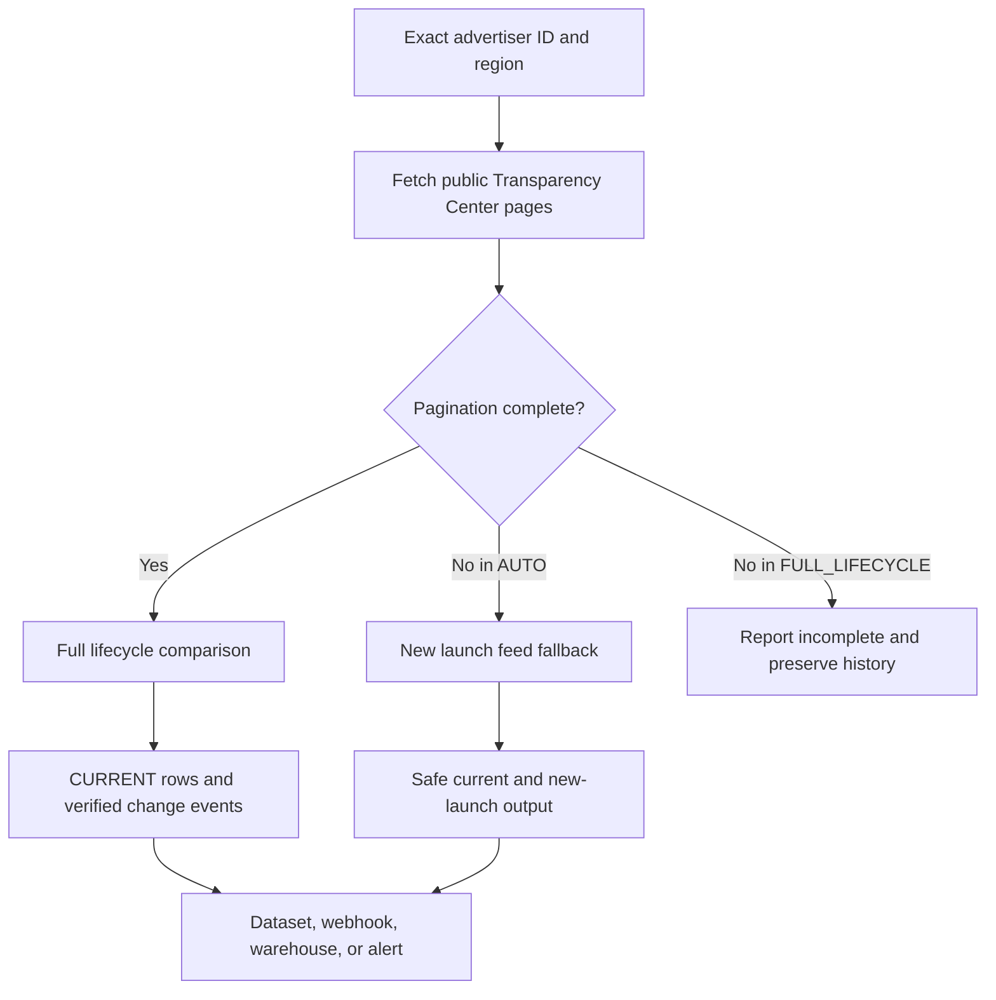

> **Live API with ongoing maintenance:** [Run Google Ads Creatives Scraper and Change Monitor on Apify](https://apify.com/kamerozkan/google-ads-verified-change-monitor)

# Google Ads Creatives and Verified Change Monitor Samples

[](https://apify.com/kamerozkan/google-ads-verified-change-monitor)


Collect current creatives from an exact Google Ads Transparency advertiser ID
and maintain a stateful feed of verified creative changes for schedules,
webhooks, warehouses, and competitor-research workflows.

The Actor reads public Transparency Center data. It is not the Google Ads
performance API and does not return spend, conversions, ROAS, or private
campaign data.

## Why this pipeline

| Data risk | Basic snapshot scraper | This Actor |
| --- | --- | --- |
| Advertiser identity | Domain or keyword results can mix accounts | Exact native `AR...` advertiser ID |
| Partial scan | Missing rows can look like stopped ads | Incomplete scans do not advance full-lifecycle state |
| First observation | Existing ads can be mislabeled as new | Baseline creates current rows and zero false change events |
| Stopped detection | One missing scan may trigger an alert | Two complete absences and a minimum six-hour gap are required |
| Automation | Repeated rows without event identity | Deterministic `eventId`, source URL, mode, and evidence |
| Large accounts | Lifecycle claims from capped data | `AUTO` can fall back to `NEW_LAUNCH_FEED` |

## Dated live evidence

On 2026-07-28, three successful build `0.0.30` task runs returned 498
contract-shaped current records:

- The Coca-Cola Company, US: 65 rows
- Netflix, DE: 91 rows
- HelloFresh SE, DE: 342 rows

All three run summaries reported `HEALTHY`, complete pagination, and zero
verified lifecycle events. That zero is important: a real change was not
invented for this repository. These are dated sample runs, not a production
SLA or a guarantee of future source coverage.

## Run an example

```bash
export APIFY_TOKEN="your_token_here"

curl --fail-with-body \
  --request POST \
  "https://api.apify.com/v2/acts/kamerozkan~google-ads-verified-change-monitor/run-sync-get-dataset-items" \
  --header "Authorization: Bearer ${APIFY_TOKEN}" \
  --header "Content-Type: application/json" \
  --data @01_track_by_advertiser_id_input.json
```

Never commit an API token.

## Three runnable inputs

<details>
<summary><strong>1. Track The Coca-Cola Company in the United States</strong></summary>

```json
{
  "advertiserIds": [
    "AR09597646619583447041"
  ],
  "region": "US",
  "monitorName": "gads-natural-cocacola-us",
  "mode": "FULL_LIFECYCLE",
  "lookbackDays": 14,
  "maxCreativesPerAdvertiser": 1000,
  "outputMode": "ALL_CHECKED",
  "includeBaseline": false,
  "includeTentative": true,
  "failOnAllTargetsFailed": true
}
```

[Open the standalone input](01_track_by_advertiser_id_input.json)

</details>

<details>
<summary><strong>2. Monitor a video-heavy advertiser in Germany</strong></summary>

```json
{
  "advertiserIds": [
    "AR18354088228836868097"
  ],
  "region": "DE",
  "monitorName": "gads-natural-netflix-de",
  "mode": "FULL_LIFECYCLE",
  "lookbackDays": 14,
  "maxCreativesPerAdvertiser": 1000,
  "outputMode": "ALL_CHECKED",
  "includeBaseline": false,
  "includeTentative": true,
  "failOnAllTargetsFailed": true
}
```

[Open the standalone input](02_monitor_video_creatives_de_input.json)

</details>

<details>
<summary><strong>3. Export a larger current creative library</strong></summary>

```json
{
  "advertiserIds": [
    "AR17410177287600472065"
  ],
  "region": "DE",
  "monitorName": "gads-natural-hellofresh-de",
  "mode": "FULL_LIFECYCLE",
  "lookbackDays": 14,
  "maxCreativesPerAdvertiser": 1000,
  "outputMode": "ALL_CHECKED",
  "includeBaseline": false,
  "includeTentative": true,
  "failOnAllTargetsFailed": true
}
```

[Open the standalone input](03_large_advertiser_snapshot_input.json)

</details>

These three inputs reproduce the private task configurations used for the dated
build `0.0.30` evidence above. They are repository samples, not additional
public Apify Store examples. Use a stable, unique `monitorName` for each
advertiser, region, and lookback scope. Avoid overlapping runs with the same
state scope.

## Output examples

The first two records below are real excerpts from successful Apify runs on
2026-07-28. The third is explicitly a deterministic lifecycle replay made with
the Actor's real event serializer and fictional fixture data.

<details>
<summary><strong>LIVE: current image creative</strong></summary>

```json
{
  "recordType": "CURRENT",
  "status": "CURRENT",
  "eventId": null,
  "eventType": null,
  "modeUsed": "FULL_LIFECYCLE",
  "region": "US",
  "advertiserName": "The Coca-Cola Company",
  "creativeId": "CR06182333637061509121",
  "format": "IMAGE",
  "firstShown": "2023-04-06",
  "lastShown": "2026-07-28",
  "sourceUrl": "https://adstransparency.google.com/advertiser/AR09597646619583447041/creative/CR06182333637061509121?region=US",
  "detectedAt": "2026-07-28T20:14:35.133Z",
  "schemaVersion": "1.0"
}
```

[Open the complete live record](01_live_current_image_output.json)

</details>

<details>
<summary><strong>LIVE: current text creative</strong></summary>

```json
{
  "recordType": "CURRENT",
  "status": "CURRENT",
  "eventId": null,
  "eventType": null,
  "modeUsed": "FULL_LIFECYCLE",
  "region": "DE",
  "advertiserName": "HelloFresh SE",
  "creativeId": "CR10179334871072112641",
  "format": "TEXT",
  "firstShown": "2026-03-19",
  "lastShown": "2026-07-28",
  "sourceUrl": "https://adstransparency.google.com/advertiser/AR17410177287600472065/creative/CR10179334871072112641?region=DE",
  "detectedAt": "2026-07-28T20:13:33.275Z",
  "schemaVersion": "1.0"
}
```

[Open the complete live record](02_live_current_text_output.json)

</details>

<details>
<summary><strong>REPLAYED FIXTURE: asset changed event</strong></summary>

This record demonstrates the exact lifecycle event shape. It was not observed
for a real advertiser and is not presented as a live change.

```json
{
  "recordType": "CHANGE",
  "status": "ASSET_CHANGED",
  "eventId": "evt_0298ff21edf6b69d8663de141567b915",
  "eventType": "ASSET_CHANGED",
  "monitorName": "replay-demo",
  "modeUsed": "FULL_LIFECYCLE",
  "region": "US",
  "advertiserName": "Replay Fixture Advertiser",
  "creativeId": "CR00000000000000000001",
  "evidence": {
    "replayedFixture": true,
    "scenario": "asset-hash-changed"
  },
  "schemaVersion": "1.0"
}
```

[Open the complete replayed record](03_replayed_asset_changed_output.json)

</details>

## Decision pipeline



## Data contract

The machine-readable contract is in
[`dataset_record.schema.json`](dataset_record.schema.json). Important fields:

- `recordType`: `CURRENT` snapshot row or `CHANGE` event
- `status` and `eventType`: lifecycle classification
- `eventId`: deterministic downstream idempotency key
- `monitorKey`: exact state scope
- `modeUsed`: `FULL_LIFECYCLE` or `NEW_LAUNCH_FEED`
- `sourceUrl`: public creative evidence page
- `previous` and `current`: change payloads
- `evidence`: event and replay diagnostics

## Limits

- Google can change, delay, remove, throttle, or limit public Transparency
  Center records.
- A missing transparency record does not prove that a campaign was deleted
  inside Google Ads.
- `NEW` reflects source dates and accepted monitor history, not an exact launch
  minute.
- Large accounts can fall back to `NEW_LAUNCH_FEED`; do not treat that mode as
  full stopped-ad detection.
- The Actor does not provide spend, conversions, ROAS, exact impressions, or
  private targeting data.
- This project is not affiliated with or endorsed by Google.

## Links

- [Run the live Actor](https://apify.com/kamerozkan/google-ads-verified-change-monitor)
- [Open the public example](https://apify.com/kamerozkan/google-ads-verified-change-monitor/examples/track-competitor-google-ads-by-advertiser-id)
- [Open the Actor API page](https://apify.com/kamerozkan/google-ads-verified-change-monitor/api)
- [Kamer Ozkan on Apify](https://apify.com/kamerozkan)

## Responsible use

Review the source terms and laws that apply to your workflow. See
[`DATA_NOTICE.md`](DATA_NOTICE.md).

## License

Original documentation and schemas in this repository are available under the
[MIT License](LICENSE). Third-party advertiser and creative data is outside
that license.
